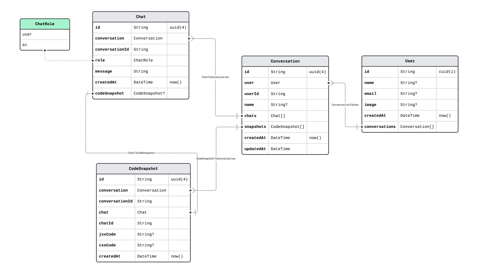

This is a assignment for the Full Stack Developer Internship not a personal Project.

### TODO
- Add DB logic for new Conversation
- Add Logic for autosave of chats
- Add UI state management with Zustand

Optional:
- Add Redis caching for performance
- Add Dockerfile for containerization

### Fixes
- Preview is working but code is not scrolling


### Tech Stack
- **Frontend**: Next.js, Shadcn UI, Tailwind CSS
- **Backend**: Node.js
- **Authentication**: OAuth with NextAuth.js
- **Database**: PostgreSQL with Neon
- **Caching**: Redis (Maybe)
- **Containerization**: Docker
- **AI Integration**: Gemini 2.0 Flash lite
- **Cloud**: Vercel and idk about the backend yet
---


### Features

- Responsive UI built with Next.js and Shadcn UI
- Secure REST API with authentication
- Redis caching for performance
- Optional: LLM integration for code generation
- Dockerized: We'll see about that
---

### Flow Example
- User logs in → get user.id
- User clicks “New Conversation” → insert into conversations
- User chats → insert into chats
- AI replies → insert into chats
- AI generates JSX → update code_snapshots
- On next user session → fetch session, chats, code → hydrate Zustand
### Database Schema



DB Local setup
```bash
    docker run --name postgres -e POSTGRES_USER=admin -e POSTGRES_PASSWORD=admin -e POSTGRES_DB=mydb -p 5432:5432 -d postgres
    npx prisma db push
    npx prisma generate
    npx prisma studio
```